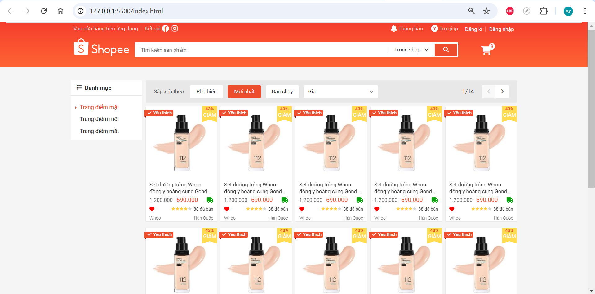
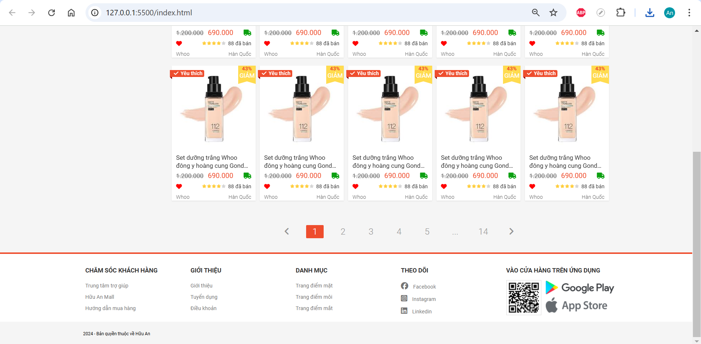

# Webshop Front End

Đây là dự án xây dựng một trang web bán hàng trực tuyến chỉ sử dụng HTML và CSS để tạo ra giao diện người dùng hoàn chỉnh. Dự án này giúp tôi và thành thạo các kỹ thuật cơ bản trong thiết kế web như cấu trúc HTML, định dạng CSS, và thiết kế giao diện đáp ứng (responsive).

## Mục tiêu dự án

- Tạo ra giao diện người dùng cho một trang web bán hàng trực tuyến.
- Sử dụng HTML để xây dựng cấu trúc của các trang như trang chủ, trang sản phẩm, giỏ hàng.
- Sử dụng CSS để tạo kiểu cho giao diện, bao gồm các yếu tố như màu sắc, typography, bố cục (layout).

## Công nghệ sử dụng

- HTML
- CSS

## Screenshots

    <h4>Homepage</h4>
    

    <h4>Sign Up</h4>
    

    <h4>Sign In</h4>
    

    <h4>Footer</h4>
  

